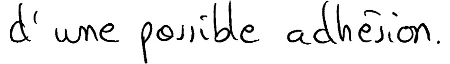

# Rimes Database

The RIMES database (_Reconnaissance et Indexation de données Manuscrites et de_
_fac similÉS_ / Recognition and Indexing of handwritten documents and faxes) was
created to evaluate automatic systems of recognition and indexing of handwritten
letters. Of particular interest are cases such as those sent by postal mail or fax
by individuals to companies or administrations.



This folder contains the scripts to reproduce the results from the paper
"Are Multidimensional Recurrent Layers Really Necessary for Handwritten Text Recognition?", by Joan Puigcerver.

## Requirements
- [ImageMagick](https://www.imagemagick.org/):
  Needed for processing the images.
- [imgtxtenh](https://github.com/mauvilsa/imgtxtenh):
  Needed for processing the images.
- [SRILM](http://www.speech.sri.com/projects/srilm/):
  Needed to build the n-gram language model.
- [Kaldi](https://github.com/kaldi-asr/kaldi):
  Needed to decode using n-gram language models.
- [Custom Kaldi decoders](https://github.com/jpuigcerver/kaldi-decoders):
  Needed to decode using n-gram language models.
- [R](https://www.r-project.org/) _(optional, but higly recommended)_:
  Needed to compute confidence intervals.

## Pipeline

### Step 1. Download data

You will first need to register to A2IA and download the Rimes dataset, used in
the ICDAR 2011 Competition. Please, visit:
http://www.a2ialab.com/doku.php?id=rimes_database:data:icdar2011:line:icdar2011competitionline

Place all the following files to `data/a2ia`:

- http://www.a2ialab.com/lib/exe/fetch.php?media=rimes_database:data:icdar2011:line:training_2011_gray.tar
- http://www.a2ialab.com/lib/exe/fetch.php?media=rimes_database:data:icdar2011:line:training_2011.xml
- http://www.a2ialab.com/lib/exe/fetch.php?media=rimes_database:data:icdar2011:line:eval_2011_gray.tar
- http://www.a2ialab.com/lib/exe/fetch.php?media=rimes_database:data:icdar2011:line:eval_2011_annotated.xml

The original training data contains some errors in the training ground-truth
that would break some of our scripts. We have included a patch of the training
XML that will fix these errors. Just execute the following command to apply
the patch (the command also checks that you have placed all the required data
to the correct location):

```bash
./steps/download.sh
```

### Step 2. Prepare data

Once the original data is downloaded and fixed, you'll need to process the
images and text data.

The processing on the text data is quite straightforward: We just extract the
text from the XML files and put them into plain text files containing the
character-level, word-level and tokenized transcripts.

The tokenization is done with a custom Python script, similar to NLTK's
Treebank tokenizer. The main difference with the NLTK's tokenizer is that
we split all characters from words composed by all-numbers and/or all-capitals.
In addition, when we tokenize a word, we keep track of the original form in
order to create a lexicon that keeps track of tokens that can/cannot be preceded
by a whitespace symbol (see `steps/rimes_tokenize.py` for more details).

The text line images are extracted using the bounding boxes present in the XML
files. We then enhance them using imgtxtenh, deskew them using ImageMagick's
convert and remove top and bottom white borders, leaving a fixed left and right
borders of 20 pixels. The line images are alse scaled at a fixed height of 128
pixels.

```bash
./steps/prepare.sh
```

### Step 3. Training

The training script replicates the final model described in the paper,
broadly speaking:

- 5 Convolutional blocks with 3x3 convolutions, LeakyReLU activations
  and batch normalization. The first 3 blocks include a MaxPooling layer,
  and the last 3 blocks use dropout with probability 0.2. The number of
  features in each block is 16, 32, 48, 64, and 80, respectively.
- 5 bidirectional LSTM recurrent layers with 256 hidden units and dropout with
  probability 0.5.
- A final linear layer with 100 output units (99 characters + CTC blank symbol).
- Training stops after 80 epochs without any improvement on the validation
  CER.

```bash
./steps/train_lstm1d.sh
```

This script will create the file `train/lstm1d_h128.t7`, where
`lstm_h${height}` is the default model name used by the training script.
If you change your height, or you change the model name with `--model_name`,
keep that in mind during the next steps.

__IMPORTANT:__ Be aware that this script may take a considerable amount of time
to run (46h on a NVIDIA Titan X) and GPU memory (10.3GB). If this is not
feasible for you, reduce the batch size (the default is 16) by passing
`--batch_size $your_batch_size` to the script, and/or reduce the early stop
epochs with `--early_stop_epochs $your_max_stop_epochs` (the default is 80).

### Step 4. Simple decoding from the neural network

Once the training is finished, you can obtain the transcript directly from
the neural network, using the CTC decoding algorithm. This algorithm simply
obtains the most likely label on each frame independently and then removes
repetitions of labels, and finally it removes the instances of the CTC blank
symbol.

The script `steps/decode_net.sh` will use Laia to decode the validation and
test lines. Just type in your console the following command:

```bash
./steps/decode_net.sh train/lstm1d_h128.t7
```

The expected results at this point on the validation and test sets are:

| Set    | CER (%) | WER (%) |
|:------ | -------:| -------:|
| Valid. | 2.2     | 9.6     |
| Test   | 2.3     | 9.6     |

In order to obtain the word-level transcripts to compute the WER, the script
simply merges into one word everything in between the whitespace symbol.

### Step 5. Decoding with word n-gram LM

These results can be improved (specially the WER) by using an external n-gram
language model. The script `steps/decode_lm.sh` will use the raw label
posteriors output by the neural network in order to create a pseudo
log-likelihood matrix. These are then combined with a word 4-gram LM, trained
on the tokenized pages from the training partition. The LM was created using
SRILM and uses modified Kneser-Ney discounting and interpolation.

The decoding is performed using a special decoder that we built on top of
Kaldi: `decode-lazylm-faster-mapped`. This decoder is similar to Kaldi's
`decode-faster-mapped`, but instead of asking for the complete decoding
transducer _HCLG_, you pass the _HCL_ and _G_ transducers separately and the
composition is done dynamically during decoding. During decoding, a beam
prunning threshold of 65 was used reduce the decoding time
(which is already very high).

All the work is done by the `steps/decode_lm.sh` script, so you just need
to execute the following command on your shell:

```bash
./steps/decode_lm.sh train/lstm1d_h128.t7
```

__IMPORTANT__: This step is very slow, if you have access to a Sun Grid Engine
(SGE) cluster, we encourage you to use `qsub` to speed up the decoding.
Please use the `--qsub_opts` option to costumize the options passed to `qsub`
(options regarding the number of tasks are automatically set).

```bash
./steps/decode_lm.sh --qsub_opts "-l h_vmem=32G,h_rt=8:00:00" train/lstm1d_h128.t7
```

The expected results at this point are:

| Set    | CER (%) | WER (%) |
|:------ | -------:| -------:|
| Valid. | 2.3     | 8.9     |
| Test   | 2.5     | 9.0     |

In order to compute the WER, we obtain the character-level alignment from
the decoding and put all characters between whitespaces together. We can
recover from tokenization, since kept this information in the lexicon
(notice that the output of the LM are _tokens_, not original _words_).

## Any problem?

If you have any issue reproducing the results of the paper, please contact the
author at joapuipe@prhlt.upv.es.
